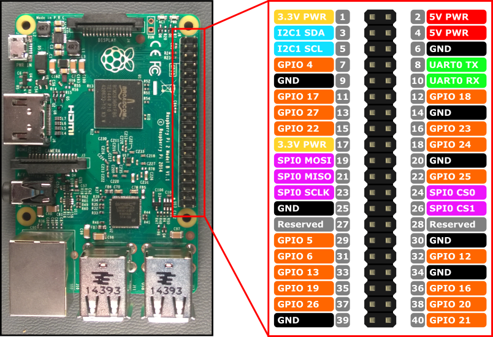

# Raspberry-BB8

One developer's adventure into building a BB-8 replica, with help from his wife and friends.

## Equipment

I'm using:

* Raspberry Pi 3 model B

    

* OSEPP Motor and Servo Shield v1.0

    

## Warnings and Pitfalls

- The Raspberry Pi 3 model B has a power management issue running the onboard wifi and bluetooth at the same time. Disable wifi if you're using the bluetooth controller, or use external dongles for either. When using wifi, the bluetooth controllers would intermittently not connect, etc.
- The OSEPP Motor and Servo Shield v1.0 Schematic had M3 and M4 reversed from what was printed on my board, and only really came with schematics for the underlying chips. See [my Programmer's Guide for the OSEPP Motor and Servo Shield](./programmers-guide-to-osepp-motor-shield.md).

## Building

1. Package the BB8 project in this repository using `dotnet`.

        dotnet publish -c Release -p:PublishSingleFile=false -p:PublishTrimmed=true -r linux-arm

    This is also saved in `publish.ps1`. With .NET 5 RC1, I found I needed turn off Single File publishing. It worked fine with .NET 5 Preview 7, however.

2. Copy the files from `\src\BB8\bin\Release\net5.0\linux-arm\publish` via to the Pi.

    * I [set up an SSH server on my Windows 10 machine within WSL.](https://superuser.com/a/1114162/45815)
    * I symlinked my publish folder to a folder in my WSL home to make it easy to find. (This really is unnecessary.)
    * I then used SCP to pull the file to my Raspberry Pi.

3. Run the project via `sudo`:

        sudo BB8

    `sudo` is necessary to use the hardware PWM features.

## Setup

Once you have the code built, you'll need to set up your configuration. By pairing a device